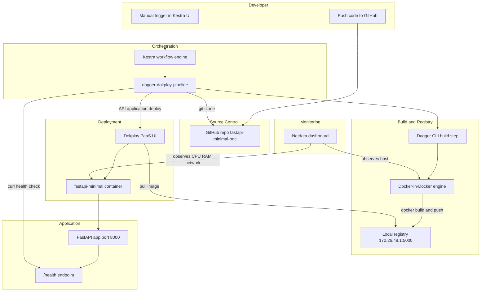

# Manager Meeting Script — Open-Source Platform PoC

**Duration:** 10–15 minutes  
**Goal:** Show we can deploy a small app using open-source tools as an alternative to managed AWS/Azure services.

---

## Architecture diagram (show this first)



---

## 1. Opening (30 seconds)

**Say:**

> "We built a proof of concept for a small internal platform using open-source tools instead of AWS or Azure managed services.  
> The goal was to show end-to-end delivery: source code → automated pipeline → container deploy → health validation → monitoring.  
> This is not production-ready at enterprise scale, but it proves the concept works on a local VM."

---

## 2. Problem we solved (1 minute)

**Say:**

> "Managers often ask: can we reduce cloud cost and vendor lock-in for smaller apps?  
> This PoC answers that with a lightweight stack: GitHub, Kestra, Dagger, Dokploy, and Netdata.  
> We deployed a minimal FastAPI service with only two endpoints: root and health check."

---

## 3. What each tool does (2 minutes)

Point at the diagram and read this table:

| Tool | Role in this PoC | AWS/Azure analogy (simple) |
|------|------------------|----------------------------|
| **GitHub** | Stores application source code | CodeCommit / GitHub integration |
| **Kestra** | Runs the pipeline when we trigger it | Step Functions / Logic Apps |
| **Dagger** | Executes build step with traceability | CodeBuild / pipeline build stage |
| **Local registry** | Stores built Docker image | ECR / ACR |
| **Dokploy** | Deploys container to runtime | App Service / ECS / Container Apps |
| **Netdata** | Shows host and container metrics live | CloudWatch / Azure Monitor (basic) |

**Say:**

> "Each piece maps to something familiar in cloud, but here it is self-hosted and open source."

---

## 4. Application we deployed (1 minute)

**Say:**

> "The app is intentionally minimal for reliability: a FastAPI service in repo `fastapi-minimal-poc`.  
> It exposes `/` for a simple JSON response and `/health` for deployment validation.  
> It runs in Docker on port 8000 with a standard Dockerfile — no database, no auth, no frontend complexity."

**Show (if live):**

- GitHub repo: `https://github.com/kirtiprasad2003/fastapi-minimal-poc`
- Browser: `/health` → `{"status":"ok"}`

---

## 5. Pipeline flow — step by step (3 minutes)

**Say while pointing at Kestra flow `dagger-dokploy-pipeline`:**

### Step 1 — Trigger
> "We push code to GitHub. For this localhost PoC, we manually click Execute in Kestra.  
> In production we could add a webhook or scheduler."

### Step 2 — Clone
> "Kestra clones the latest code from GitHub branch `main`."

### Step 3 — Build (Dagger)
> "Dagger runs the build through `dagger run`, which gives us pipeline trace visibility.  
> Docker builds image `fastapi-minimal:latest`."

### Step 4 — Push to registry
> "The image is pushed to our local registry at `172.26.48.1:5000`.  
> Dokploy pulls from this registry during deploy."

### Step 5 — Deploy (Dokploy API)
> "Kestra calls Dokploy API `application.deploy` with the correct application ID for `fastapi-minimal`.  
> Dokploy pulls the new image and redeploys the service."

### Step 6 — Verify
> "Kestra waits briefly, then calls `/health`.  
> If health returns OK, pipeline success is confirmed."

---

## 6. Live demo script (5 minutes)

Do this in order:

| # | Action | What to say |
|---|--------|-------------|
| 1 | Open Netdata Overview (`localhost:19999`) | "Monitoring is already running on the host." |
| 2 | Open Kestra flow and click Execute | "I am triggering the delivery pipeline manually." |
| 3 | Show Kestra logs: clone → dagger run → dokploy API | "These are the automated stages." |
| 4 | Open Dokploy Deployments | "Here we see deployment record titled Kestra Dagger deploy." |
| 5 | Open app `/health` | "Application is live and healthy." |
| 6 | Point at Netdata CPU/network charts | "We can see resource activity during deploy." |

---

## 7. Outcomes / deliverables (1 minute)

**Say clearly:**

> "**Outcome 1:** We successfully deployed a containerized FastAPI app using open-source tooling.  
> **Outcome 2:** We have a repeatable pipeline: Kestra orchestrates build and deploy.  
> **Outcome 3:** We validate deployments automatically with a health check.  
> **Outcome 4:** We have real-time infrastructure visibility with Netdata.  
> **Outcome 5:** We demonstrated a viable alternative narrative to managed cloud for small workloads."

**Evidence checklist:**

- [ ] Kestra execution: SUCCESS
- [ ] Dokploy deployment: completed for `fastapi-minimal`
- [ ] Registry contains `fastapi-minimal:latest`
- [ ] `/health` returns `{"status":"ok"}`
- [ ] Netdata shows host metrics during run

---

## 8. Limitations (be honest — 1 minute)

**Say:**

> "This PoC runs on localhost/WSL, so GitHub cannot auto-trigger Kestra without a public URL or tunnel.  
> We used manual trigger for demo reliability.  
> Dagger module SDK had version constraints, so build runs via `dagger run` wrapper for stability.  
> This stack is excellent for cost-sensitive internal apps, but for large scale, compliance, and multi-region HA, managed cloud still has advantages."

---

## 9. AWS/Azure comparison slide (30 seconds)

**Pros of this open-source stack:**

- Lower recurring platform cost
- Full control over pipeline and deployment
- No vendor lock-in for core workflow

**Cons vs managed cloud:**

- More ops responsibility (updates, backups, security hardening)
- We own reliability and scaling design
- Enterprise features (IAM, audit, global HA) need extra work

**Recommendation:**

> "Use this approach for prototypes, internal tools, and small services now.  
> Define thresholds (traffic, compliance, team size) for when to move to AWS/Azure managed services."

---

## 10. Likely manager questions + answers

**Q: Why not just use AWS/Azure directly?**  
A: For small apps, this reduces cost and gives control. Cloud is still better at massive scale and enterprise governance.

**Q: Is this production ready?**  
A: Not fully. It is a validated PoC. Production needs secrets management, HA, backups, and security hardening.

**Q: Can this run automatically on git push?**  
A: Yes, with a public endpoint/webhook or CI runner. Manual trigger was used for localhost demo stability.

**Q: What did Dagger add?**  
A: Traceable build execution and portable pipeline logic; it separates build orchestration from deploy orchestration.

**Q: What does Netdata prove?**  
A: We can observe deployment impact on CPU/memory/network in real time without paid cloud monitoring.

**Q: What is next if approved?**  
A: Harden secrets, add staging environment, enable auto-trigger, and add alerting (Uptime Kuma or Grafana).

---

## 11. Closing line (15 seconds)

**Say:**

> "In summary, we proved a working open-source mini-platform: Git → Kestra → Dagger build → Dokploy deploy → health validation → Netdata monitoring.  
> It is suitable as a foundation for small internal workloads and a clear alternative path before committing to full cloud managed services."

---

## Quick reference URLs (fill before meeting)

| Service | URL |
|---------|-----|
| Dokploy | http://localhost:3000 |
| Kestra | http://localhost:8085 |
| Netdata | http://localhost:19999 |
| App health | http://172.26.48.1:8000/health |
| GitHub repo | https://github.com/kirtiprasad2003/fastapi-minimal-poc |

---

## One-page cheat sheet (pin on second screen)

```
STORY:  Git → Kestra → Dagger → Registry → Dokploy → Health → Netdata
APP:    fastapi-minimal-poc (/ and /health)
TRIGGER: Manual Execute in Kestra (localhost PoC)
PROOF:  Kestra SUCCESS + Dokploy deploy + /health OK + Netdata charts
LIMIT:  Localhost demo, manual trigger, not enterprise HA yet
ASK:    Approve next phase: hardening + auto-trigger + alerting
```
